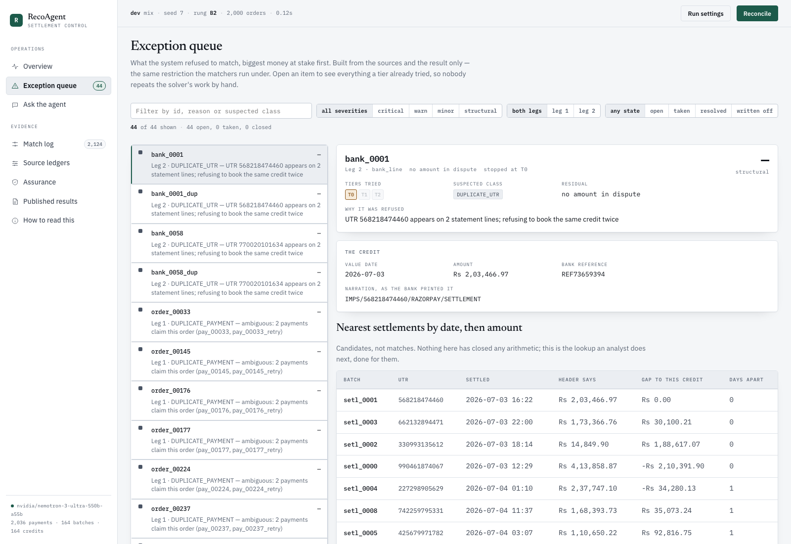
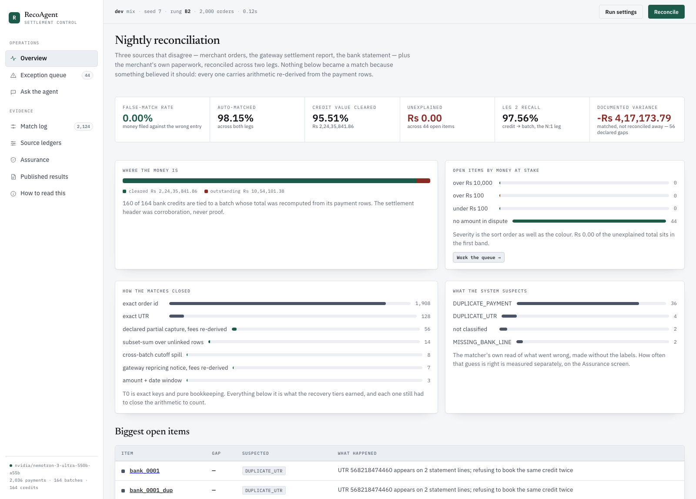
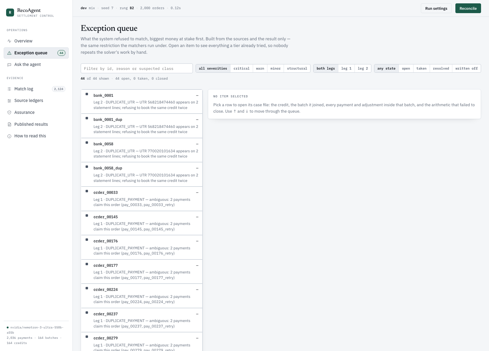
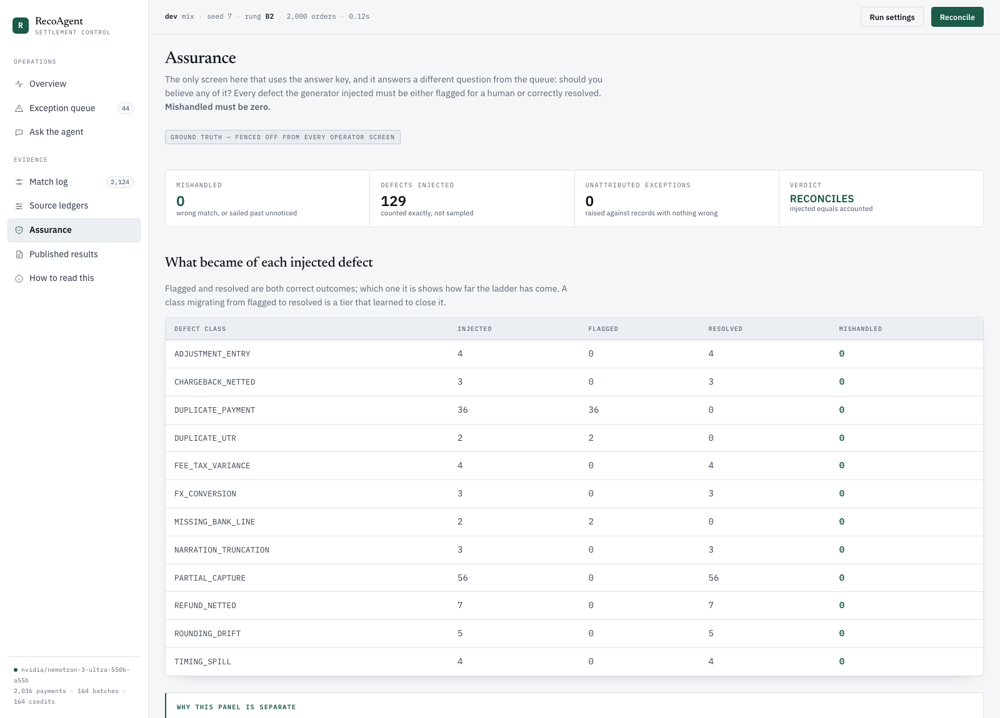
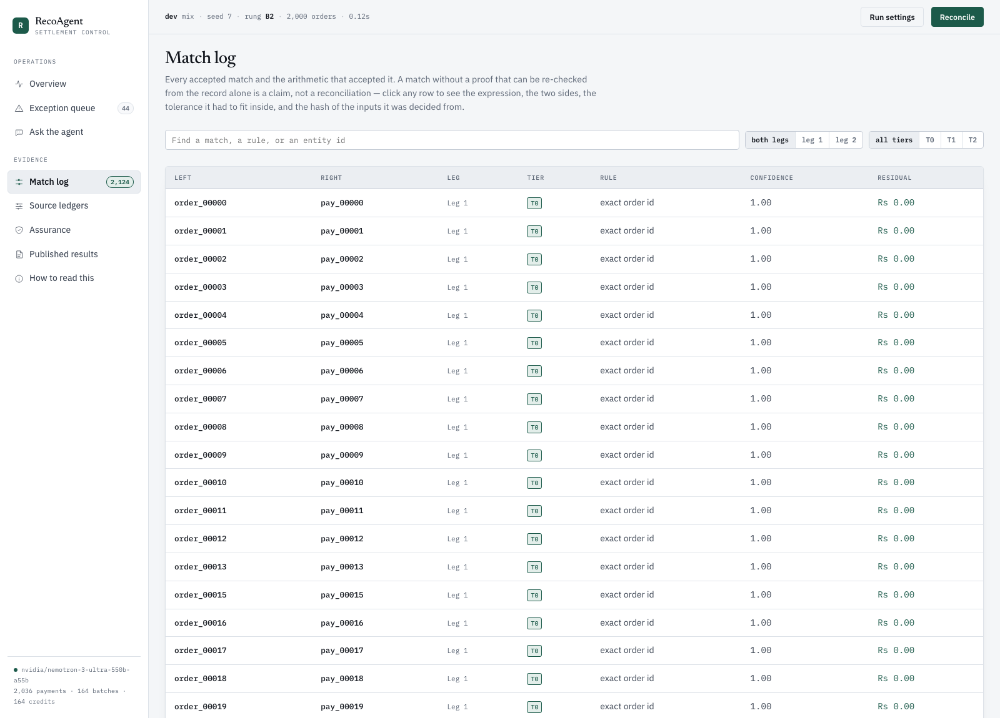
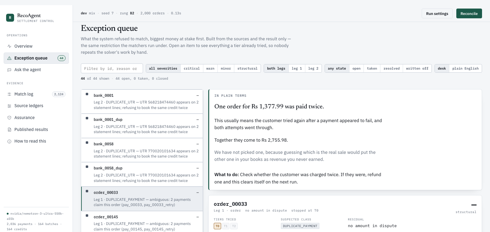

# RecoAgent

[](https://github.com/ch24btech11028-create/recoagent/actions/workflows/ci.yml)

**A settlement reconciliation engine that proves every match before it books
it — and files an exception rather than guessing.**

Deterministic solvers do the matching. The reconciliation then determines most
of the accounting. A model is allowed to speak only about what is left, never
without quoting the evidence, and nothing it says is booked until the
arithmetic closes.



*Every refusal opens into a case file: which tiers were tried, why it stopped,
the credit as the bank printed it, and the candidates an analyst would check
next. Nothing here was matched, and the reason is on the screen.*

---

## The one number that isn't ours

Every settlement figure below is measured on data this repository generated.
That is a real limit, so the same discipline is run against a corpus nobody
here produced: **BenchRec** (ICAIF 2023, CC BY 4.0), 32,048 labelled bank
statement lines from a corporate cash ledger. It ships with a language-model
matcher's own predictions, which makes the comparison like-for-like on
identical rows.

| | Coverage | **Wrong-match rate** |
|---|---:|---:|
| `MatcherByChatGPT` (ships with BenchRec) | 64.90% | **4.80%** |
| **RecoAgent** | **84.36%** | **0.28%** |

Higher coverage and a wrong-match rate **17× lower**, in 0.5 seconds over the
full set. The baseline reported high confidence on all 998 of its wrong
matches; each one is money filed against the wrong entry for someone to unpick
later.

It is not a tuned number. The tier that matched on amount while ignoring the
value date was **removed** after measurement, because it bought 0.7 points of
coverage and caused 45% of all errors — a trade the lead metric refuses. Full
report and every refusal reason in
[`results/benchrec_recoagent.txt`](results/benchrec_recoagent.txt);
`tests/test_benchrec.py` pins these numbers.

---

## Ninety seconds

Python 3.11+, **no third-party dependencies** in the deterministic core.

```bash
# 1. Reconcile 2,000 orders against a gateway report and a bank statement.
python3 -m recoagent.run --n 2000 --seed 7 --rung B2 --exceptions 5

# 2. Score the same discipline on someone else's benchmark.
python3 -m recoagent.eval.benchrec --data data/benchrec

# 3. Meet three defect classes the engine has no tier for.
python3 -m recoagent.run --n 2000 --seed 21 --profile unknown --rung B2
```

Then open the console:

```bash
python3 -m recoagent.ui
```

---

## Results

2,000 orders → 2,036 payments → 164 settlement batches → 164 bank credits.
Held-out runs use a different seed **and** a defect mix the matcher was never
tuned on. Whole batch runs in **0.15s**, single-threaded, holding **~125,000
records/sec across a 50× range**. Artifacts in [`results/`](results/).

| | B0 dev | B0 held-out | **B2 dev** | **B2 held-out** | clean (control) |
|---|---:|---:|---:|---:|---:|
| **False-match rate** | **0.00%** | **0.00%** | **0.00%** | **0.00%** | **0.00%** |
| Auto-match rate | 93.85% | 93.85% | 98.15% | 97.13% | 100.00% |
| Credit value matched | 71.99% | 77.25% | 95.51% | 98.18% | 100.00% |
| Leg 1 recall (order → payment) | 95.40% | 95.40% | **98.20%** | **97.00%** | 100.00% |
| Leg 2 recall (credit → batch) | 75.00% | 75.00% | **97.56%** | **98.78%** | 100.00% |
| Leg 1 exceptions | 92 | 92 | 36 | 60 | 0 |
| Leg 2 exceptions | 41 | 41 | 4 | 2 | 0 |
| Variance carried on matches | — | — | Rs 4,17,173.79 | Rs 2,40,111.98 | Rs 0 |
| Defects mishandled | 0 | 0 | 0 | 0 | 0 |

**Read the first row first.** A reconciliation engine that matches everything
and is occasionally wrong is worse than useless: it books money against the
wrong transaction and hides the error behind a green number. BenchRec states
the principle directly — better to leave a transaction unmatched for manual
review than to match it incorrectly. So false-match rate leads, throughput
follows, and the exception list is published rather than summarised.

**The variance row is not a rounding note.** B2 matches 56 orders on dev that
B0 refuses, and every one is short: the gateway captured less than the order
authorised. Matching them does not make that money agree, so the gap stays on
the match record and is reported rather than absorbed.

Every class that can be closed mechanically is closed mechanically first — an
orphaned refund, a chargeback with its dispute fee, a manual adjustment,
sub-rupee drift, a T+2 cutoff spill, a repricing on file. Spill pairing would
have been the most impressive-looking thing to hand a model, and handing it
over would have let the model take credit for what arithmetic closes on its
own. See [EVIDENCE.md](EVIDENCE.md) for how each tier earns its place.

---

## What happens when it meets something nobody wrote code for

Changing the defect *mix* between dev and held-out varies the proportions
inside a vocabulary both the generator and the matcher were built from. It
cannot vary the vocabulary itself — and a 0.00% false-match rate over twelve
classes the author already thought about is partly a statement about the
engine and partly a statement about the author's imagination.

So [`recoagent/unknown.py`](recoagent/unknown.py) defines three further defect
classes, all real events on Indian settlement books, and **no handling for any
of them exists anywhere in the engine**:

| Class | What it is | Why nothing reaches it |
|---|---|---|
| `TDS_194O_WITHHELD` | 0.1% statutory TDS withheld on gross and remitted against the merchant's PAN | Every deduction modelled is a function of fee or net; this is a percentage of gross, paid to a third party |
| `BANK_CHARGE_DEBIT` | The receiving bank takes its own RTGS charge plus GST out of the credit | Every explanation is built from gateway rows, and there is no gateway row behind it |
| `SPLIT_PAYOUT` | One settlement paid out as two transfers with two UTRs | Leg 2 is N:1 by construction — one settlement arriving as two credits is not merely unreached, it is unrepresentable |

The profile is the held-out mix plus these three and **nothing else**, so the
comparison is controlled; `tests/test_unknown.py` asserts the known-class
counts are identical. Recall is expected to fall and does. The question is what
the engine does with a gap it cannot explain, and the risk is real rather than
theoretical: `legs/ssmp.py` will happily search for a subset summing to a
residual it was never meant to see.

| profile = `holdout` + 3 unwritten classes | held-out | **unknown** |
|---|---:|---:|
| Leg 2 recall | 98.78% | **88.10%** |
| Leg 2 exceptions | 2 | 20 |
| **False-match rate** | **0.00%** | **0.00%** |
| Unknown classes contained (filed as exceptions) | — | **14 of 14** |
| Unknown classes absorbed silently | — | **0** |
| Unknown classes wrong-matched or missed | — | **0** |

**14 of 14 filed, nothing guessed, nothing quietly absorbed.** The 10.7 points
of recall are what containment costs, and reporting the cost is the point.
`recoagent.unknown` is fenced off from every matcher by the same test that
fences off ground truth, and CI fails if any of these is ever wrong-matched.
Artifact: [`results/B2_unknown.txt`](results/B2_unknown.txt).

If one of these classes is ever given a tier, it moves to `defects.py` and a
new one takes its place. The point is not these three events. The point is that
there are always three more.

---

## What the model does, and what it does not

This is the section most likely to disappoint, and it is measured rather than
argued.

**Categorisation (C0 → C1 → C2).** Every row gets an accounting category. The
interesting number is not accuracy — it is how few rows a model touches at all.

| Rung | What it may use | Rows assigned | Coverage | Wrong-category rate |
|---|---|---:|---:|---:|
| **C0** | source fields only | 8 | **0.86%** | 0.00% |
| **C1** | + what the reconciliation proved | **885** | **94.86%** | **0.00%** |
| **C2** | + a model that must quote its evidence | 4 held, not booked | 94.86% | **0.00%** |

**C0 exists to be embarrassing.** Reading `status`, `method` and narration
without a reconciliation behind them gets you **0.86%**. Any tool reporting
"95% accurate AI categorisation" on this book is reporting the reconciliation's
work, or a status field's, and C0 is the rung that makes that legible. C1 does
the work: a payment that closed against an order *is* revenue — not "probably
revenue, 0.94".

**C2, live** (`gemini-3.5-flash-lite`, 20 rows,
[`results/C2_dev.txt`](results/C2_dev.txt)): the model correctly declined **16
of 20**, fabricated **zero** quotations, committed to 4 answers and got **1**
right. The citation contract held perfectly and the model still got three of
four wrong while quoting the row correctly every time — a citation proves the
evidence exists, not that the conclusion follows. So a C2 assignment is held
for approval, never booked. That run **replays with no API key** from
[`data/llm-cache/`](data/llm-cache/), which is the only way a reader can check
a live-model claim rather than take it.

**The agent tier (B3).** With the merchant's paperwork in the book, the
deterministic tiers close everything provable and **zero cases reach the model
at all**. Withholding the paperwork puts it back in its designed territory,
and there it resolves **zero**, holds several for approval, and declines the
rest. Every rupee it might have booked rests on a rate nobody issued, so it is
a hypothesis with working attached rather than a reconciliation.

Reporting only `resolved` would be measuring the gate, not the model — a tier
that reasons well and is declined on policy and one that reasons badly and gets
caught both report zero. So the report also grades **whether the hypothesis
named the right evidence**, over every case the model worked, booked or not:

| `nemotron-3-ultra-550b`, paperwork withheld | dev | held-out |
|---|---:|---:|
| Attempted (of the residual-bearing leg-2 items) | 7 of 7 | 9 of 9 |
| Resolved (source-backed) | **0** | **0** |
| Held for approval — arithmetic closed on an unconfirmed rate | 4 | 7 |
| Declined by the model | 1 | 2 |
| Malformed reply | 2 | 0 |
| Endpoint failed | 0 | 0 |
| **Hypotheses that named applicable evidence** | **4 of 4 (100%)** | **7 of 7 (100%)** |
| Spend | $0.03 | $0.04 |

**Zero resolved and 100% right about why are both true, and they are different
facts.** The model worked out the correct account of every residual it took on;
not one of those accounts rested on a rate the merchant could produce, so not
one was booked. That is the gate doing its job, not the model failing at its
own — and without this row the two are indistinguishable.
It replicates across both profiles on a different seed and a defect mix the
matcher was never tuned on. `tests/test_b3_eval.py` proves the number can
fail; full runs in [`results/B3_dev_nopaper.txt`](results/B3_dev_nopaper.txt)
and [`results/B3_holdout_nopaper.txt`](results/B3_holdout_nopaper.txt).

**Asking it questions.** The console has a box you can type a question into.
The same two rules apply as everywhere else: the model is handed a factsheet
built from the run by code -- it has no memory of the batch and no way to
invent one -- and answers are typed and compared **by code**, never graded by a
second model. A benchmark graded by a model is not a benchmark.

| `nemotron-3-ultra-550b`, 17 derived questions | dev | held-out |
|---|---:|---:|
| **Wrong-answer rate** | **0.00%** | **0.00%** |
| **Hallucinated** — answered what the factsheet cannot support | **0** | **0** |
| Coverage | 88.24% | 88.24% |
| Correct | 17 of 17 | 17 of 17 |
| Declined | 2 | 2 |
| Call failed | 0 | 0 |
| Wall clock | 61s | 81s |

The two declines are the point rather than a shortfall: the bank plants
questions that **cannot** be answered from the book -- a bank credit that does
not exist, a customer's email address, which member of the finance team
approved a payout -- and declining them is the correct answer. A question typed
into the console is answered but returned **ungraded**, because it has no
ground truth, and so it cannot move the number above.

```bash
python3 -m recoagent.qa.run --profile dev --out results/qa_dev.txt
```

Full runs in [`results/qa_dev.txt`](results/qa_dev.txt) and
[`results/qa_holdout.txt`](results/qa_holdout.txt).

---

## The console

`python3 -m recoagent.ui` — binds to loopback, needs no key (Q&A disables
itself without one), and serves an operator dashboard rather than a page.

| | |
|---|---|
|  |  |
| **Overview** — where the money is, how each match closed, and the biggest open items by amount at stake. | **Exception queue** — what the system refused, biggest money first, filterable by leg, severity and state. |
|  |  |
| **Assurance** — the only screen that reads the answer key, and it asks a different question: should you believe any of it? | **Match log** — every accepted match opens to the proof: the expression, both sides, the tolerance, and the input hash. |

The queue is backed by [`recoagent/worklist/`](recoagent/worklist/) — sqlite,
so zero dependencies survives. Idempotent on `(leg, entity_kind, entity_id)`,
so human work survives a re-run, and carry-forward closes an item **only** when
a later run saw the entity *and* matched it.

```bash
python3 -m recoagent.worklist --carry-forward
```

### The same finding, in the merchant's language

Everything else in this repository is written for an analyst, and it shows:

> `ambiguous: 2 payments claim this order (pay_00033, pay_00033_retry)`

That is the right sentence for the desk and the wrong one for the person whose
money it is. So [`recoagent/plain.py`](recoagent/plain.py) says it again:

> **One order for Rs 1,377.99 was paid twice.** This usually means the customer
> tried again after a payment appeared to fail, and both attempts went through.
> Together they come to Rs 2,755.98. We have not picked one, because guessing
> which is the real sale would put the other one in your books as revenue you
> never earned.
> **What to do:** Check whether the customer was charged twice. If they were,
> refund one and this clears itself on the next run.



**The sentence is generated from the proof, never asked of a model.** The
tempting version of this feature is a second, friendlier field in the
proposer's reply — which would put a fluent, confident paragraph in front of
the reader least equipped to doubt it, with nothing checking it against the
ledger. It is also unnecessary: by the time anything reaches a screen,
`agent/citations.py` has already priced every cited row and recorded the
claimed rate against the rate on file. The facts exist; only the phrasing was
missing, and phrasing is a template. Which is why
`test_the_rupees_in_the_sentence_are_the_rupees_in_the_proof` can exist at all.

Where a model does write the prose — a refusal has no priced resolution to
render from — it is given a house style rather than a free hand, and the
analyst text is kept beside the plain one rather than replaced by it. Both
readers get their own register; neither is the other's summary.

**It is measured, not asserted.** `tests/test_plain.py` scans every account on
three books for row ids, `snake_case`, paise, basis points and tier names, and
scores the result for reading ease:

| | accounts | mean Flesch | worst |
|---|---:|---:|---:|
| dev | 44 | **78.6** | 73.1 |
| held-out | 67 | **78.7** | 73.1 |
| unknown | 85 | **77.3** | 69.2 |

One honest note on that table: **reading-ease scoring cannot tell the two
registers apart on its own.** The analyst line above scores ~61 — *higher* than
some of the plain ones — because Flesch counts syllables, and `card_domestic`
is short. The jargon scan is what actually separates them; the score guards the
other direction, against plain words assembled into long clause-heavy
sentences. The test says so rather than lowering a threshold until the suite
agrees with a claim it cannot support.

---

## Razorpay

```bash
python3 -m recoagent.razorpay.run pull --out data/razorpay/pull.json
python3 -m recoagent.razorpay.run reconcile data/razorpay/pull.json --bank bank.csv
python3 -m recoagent.razorpay.run serve --port 8000     # webhook receiver, HMAC verified
```

`pull` refuses an `rzp_live_` key. `reconcile` needs neither key nor network —
it replays a recorded pull, so a published number can be re-checked by someone
with no account, and CI reconciles a committed fixture on every push.

**What this has and has not been exercised on.** Test mode does not settle, so
the recorded pull is small and **Leg 2 has never run against live Razorpay
data** — the shape is Razorpay's, the volume is ours. That is a property of
the sandbox, and it is precisely why the engine takes a bank statement
alongside any pull rather than assuming the gateway hands you both sides.

Two real bugs fell out that synthetic data structurally could not contain:

1. **A failed payment was matched to its order.** A declined card leaves a row
   carrying the full order amount, and an exact join gated only on
   `gross == order.amount` matches it perfectly — booking revenue that never
   arrived, on the tier with the highest confidence.
2. **Razorpay's `fee` includes GST; ours does not.** Copying both fields books
   the tax twice, silently, producing a consistent wall of fee-variance
   exceptions for a model to explain.

Or point it at your own CSVs — `python3 -m recoagent.ingest` folds header
names, parses rupees as strings into integer paise, and **refuses to print an
accuracy figure**, because unlabelled data has no answer key.

---

## Verify it

Nothing here asks to be taken on trust.

```bash
python3 -m pytest -q                                  # 433 tests
python3 -m recoagent.audit.mutate --n 2000            # 17 attacks, 420 cases
python3 -m recoagent.journal --n 2000 --seed 7        # trial balance
```

- **The matcher cannot see the answer key.** `tests/test_independence.py`
  parses every matcher module and fails if one imports the generator or names a
  ground-truth type. The same fence covers `recoagent.unknown`.
- **CI runs the whole pipeline with nothing installed** — no `pip install` at
  all — diffs a repeat run byte-for-byte, and diffs fresh runs against the
  committed artifacts, including the unknown-class result.
- **The adversarial audit publishes what got through.** 17 attacks over 420
  cases, scored across *every* match so collateral damage counts. Two forgeries
  are uncontained, sit in `KNOWN_UNCONTAINED`, print on every run, and a test
  stops the disclaimer outliving the weakness.
- **Invalidated numbers are kept, not deleted.** [`results/void/`](results/void/)
  holds runs whose contract no longer exists, with a note on why each may not be
  quoted.

| Rung | Leg 1 | Leg 2 | State |
|---|---|---|---|
| **B0** | exact join | exact UTR | **built, measured** |
| B1 | + Splink (Fellegi-Sunter) | — | not built |
| **B2** | + documented partial capture | + SSMP, tolerance, spill pairing | **built, measured** |
| **B3** | *(unchanged)* | + LLM exception tier | **built, measured live; 0 resolved** |

---

## Layout

```
recoagent/
  legs/                    the matching tiers: exact keys, SSMP, spill pairing
  agent/                   the LLM exception tier, its gate and its citations
  categorize/              C0/C1/C2 and the citation contract
  journal/                 double-entry posting and the trial balance
  razorpay/                stdlib API client, mapping, webhook receiver
  worklist/                the exception queue: idempotent, carry-forward
  audit/mutate.py          the adversarial audit
  plain.py                 the same finding, in the merchant's language
  unknown.py               defect classes with no tier behind them
  eval/                    the scorers, BenchRec, throughput, repeatability
  ui.py, web/              the operator console
results/                   committed run artifacts
tests/             439 tests
```

- [EVIDENCE.md](EVIDENCE.md) — how each tier earns its place, the adversarial
  audit in full, the clearing account, and the bugs real data exposed.
- [ARCHITECTURE.md](ARCHITECTURE.md) — design decisions, the tolerance
  argument, and what is deliberately not built.

---

## Data and attribution

Settlement figures come from synthetic data generated by this repository. No
merchant data, real or sampled, is used anywhere. The BenchRec result is the
exception: that corpus is third-party, real, and nothing here produced it.

- Subset Sum Matching Problem — Wu et al., 2025
- [FinBalance](https://arxiv.org/abs/2606.15949) — Tumpati et al., 2026
- [Splink](https://github.com/moj-analytical-services/splink) (MIT) — planned Leg 1 baseline
- [BenchRec](https://www.kaggle.com/datasets/benchmarkteam/benchrec-real-world-cash-reconciliation-dataset) / ICAIF 2023 (CC BY 4.0) — the external benchmark

Licensed under the MIT License — see [LICENSE](LICENSE).
